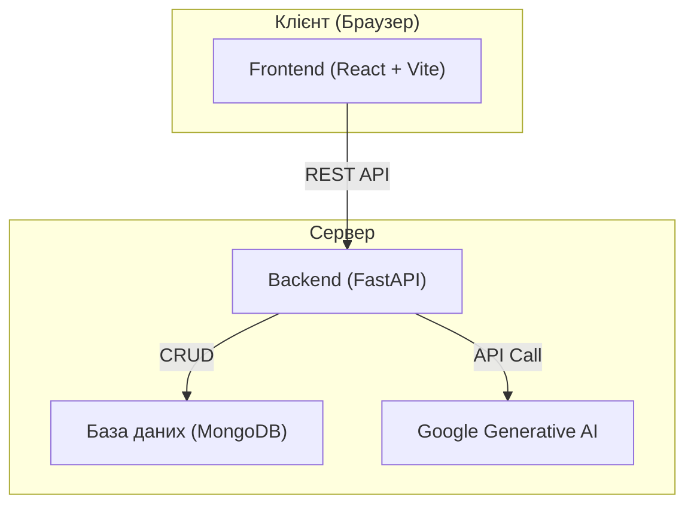

# 📊 Програмно-аналітичний комплекс для аналізу та моніторингу потреб молоді


Це дипломний проєкт, що являє собою веб-додаток для автоматизації процесу збору, аналізу та візуалізації даних соціологічних опитувань. Головна мета — надати зручний інструмент для моніторингу потреб молоді, використовуючи сучасні технології, включно з аналізом за допомогою штучного інтелекту.

## ✨ Ключові можливості

-   **📝 Гнучкий конструктор опитувань:** Створення анкет з різними типами запитань.
-   **🤖 AI-аналіз текстових відповідей:** Автоматичне узагальнення та виявлення ключових тем у відкритих питаннях за допомогою Google Generative AI.
-   **📊 Інтерактивні дашборди:** Візуалізація кількісних даних у вигляді графіків та діаграм.
-   **📄 Автоматична генерація звітів:** Можливість експорту результатів аналізу у форматі PDF.
-   **🔐 Розмежування доступу:** Система автентифікації для адміністраторів та користувачів.

## 🏛️ Архітектура

Система побудована на основі клієнт-серверної архітектури, що складається з трьох основних компонентів:



## 🛠️ Стек технологій

| Компонент | Технологія                                                                      |
| :-------- | :------------------------------------------------------------------------------ |
| **Backend** | `Python`, `FastAPI`, `Pydantic`, `Uvicorn`                                      |
| **Frontend**| `React`, `TypeScript`, `Vite`, `axios`                                          |
| **База даних**| `MongoDB` (з використанням `pymongo`)                                           |
| **Аналіз даних**| `Pandas`, `Matplotlib`, `google-genai`                                          |
| **Звіти**   | `fpdf2`                                                                         |

## 🚀 Налаштування та запуск

Для запуску проєкту локально виконайте наступні кроки:

### Передумови

-   [Python 3.10+](https://www.python.org/downloads/)
-   [Node.js 18+](https://nodejs.org/en/)
-   [MongoDB](https://www.mongodb.com/try/download/community) (локально або через Atlas)

### 1. Клонування репозиторію

```bash
git clone <URL-вашого-репозиторію>
cd <назва-директорії-проєкту>
```

### 2. Налаштування Backend

```bash
# Перейдіть у директорію бекенду
cd backend

# Створіть та активуйте віртуальне оточення
python -m venv venv
source venv/bin/activate  # для Linux/macOS
.\venv\Scripts\activate   # для Windows

# Встановіть залежності
pip install -r requirements.txt

# Створіть файл .env та додайте змінні середовища
# (MONGO_URI, GOOGLE_API_KEY, та ін.)
cp .env.example .env
# Відредагуйте .env

# Запустіть сервер
uvicorn main:app --reload
```

Сервер буде доступний за адресою `http://localhost:8000`.

### 3. Налаштування Frontend

```bash
# Перейдіть у директорію фронтенду
cd ../frontend

# Встановіть залежності
npm install

# Створіть файл .env та вкажіть URL бекенду
# VITE_API_BASE_URL=http://localhost:8000
cp .env.example .env
# Відредагуйте .env

# Запустіть додаток
npm run dev
```

Клієнтська частина буде доступна за адресою `http://localhost:5173` (або іншим портом, вказаним Vite).

## 🖼️ Галерея

*(Тут ви можете додати скріншоти вашого додатку)*

| Дашборд                               | Конструктор опитувань                 |
| :------------------------------------: | :------------------------------------: |
|  |  |

## 📄 Ліцензія

Цей проєкт розповсюджується за ліцензією MIT. Детальніше дивіться у файлі [LICENSE](LICENSE).
